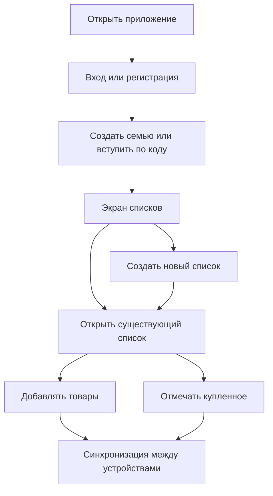

## 1. Обзор продукта
PWA-приложение для iOS (через «Добавить на экран Домой») для пары/семьи: общие списки покупок с моментальной синхронизацией и отметкой «куплено/не куплено».
- Решает проблему «кто что уже взял» и дублирующихся покупок, поддерживает работу вдвоём в одном списке в реальном времени.

## 2. Ключевые функции

### 2.1 Роли пользователей
| Роль | Способ входа | Ключевые права |
|------|--------------|----------------|
| Пользователь | Email + пароль | Создавать/редактировать списки и товары, отмечать покупки, видеть изменения в реальном времени |

### 2.2 Функциональные модули
1. **Авторизация и семья**: регистрация/вход, создание «семьи/дома», приглашение второго пользователя.
2. **Списки**: создание/удаление/переименование списка, быстрый поиск, сортировка.
3. **Товары в списке**: добавление/редактирование/удаление, чекбокс «куплено», сортировка (некупленные сверху), массовые действия.
4. **Синхронизация**: моментальные обновления между устройствами, индикатор статуса сети/синка.
5. **PWA-установка**: подсказка «Добавить на экран Домой», запуск в режиме приложения, офлайн-экран.

### 2.3 Детализация страниц
| Страница | Модуль | Описание |
|--------|--------|----------|
| Вход/Регистрация | Email + пароль | Вход, регистрация, восстановление пароля |
| Вход/Регистрация | Создание/вступление в «семью» | Создать семью (генерировать код/ссылку приглашения) или вступить по коду |
| Списки | Список списков | Карточки/строки списков, поиск, кнопка «Новый список» |
| Списки | Быстрые действия | Переименование, удаление, закрепление (опционально) |
| Список (детали) | Заголовок и метаданные | Название, счетчик «куплено/всего», меню «Поделиться/Пригласить» |
| Список (детали) | Добавление товара | Быстрый ввод, поддержка «+» для добавления, автоскролл, фокус на поле |
| Список (детали) | Товары | Чекбокс, свайпы (удалить/редактировать), группировка «Некуплено/Куплено» |
| Список (детали) | Массовые действия | «Снять все отметки», «Очистить купленное» |

## 3. Основные пользовательские сценарии
1. Пользователь устанавливает PWA на iPhone через Safari → «Поделиться» → «На экран Домой».
2. Пользователь регистрируется и создаёт «семью/дом».
3. Пользователь отправляет второй половине код/ссылку приглашения; второй пользователь регистрируется и вступает в семью.
4. Любой пользователь создаёт список «Продукты».
5. Оба в реальном времени добавляют товары и отмечают купленное; статусы синхронизируются.

## 4. Дизайн интерфейса

### 4.1 Стиль
- Общая идея: «Apple-like» минимализм, полупрозрачные поверхности, аккуратные разделители, мягкие анимации.
- Цвета: нейтральная база (светлая/тёмная) + один акцентный цвет (iOS blue) для primary действий.
- Типографика: системный стек iOS/macOS (SF Pro через `-apple-system`), чёткая иерархия размеров.
- Компоненты: округлённые карточки, iOS-подобные списки, segmented control (если нужен), большие тач-таргеты.
- Иконки: SF Symbols-стилистика (в вебе — через близкие по виду иконки/набор, без копирования ассетов).
- Микроанимации: плавные появления, лёгкие пружинящие состояния на нажатие, нативные переходы между экранами.

### 4.2 Обзор дизайна по страницам
| Страница | Модуль | UI-элементы |
|--------|--------|-------------|
| Вход/Регистрация | Форма | Поля с «floating label», крупная primary-кнопка, inline ошибки |
| Вход/Регистрация | Вступление в семью | Экран «ввести код», кнопка «скопировать код приглашения», статус присоединения |
| Списки | Список | iOS list с разделителями, swipe actions, кнопка «+» |
| Список (детали) | Товары | Чекбоксы, состояние «куплено» с приглушением, haptic-like feedback (визуально) |
| Список (детали) | Статусы | Индикатор «Онлайн / Офлайн», «Синхронизировано» |

### 4.3 Адаптивность
- Подход: mobile-first (как основное), поддержка desktop (широкий контейнер, центрирование, боковые отступы).
- Touch: минимальная высота строк и кнопок 44px, безопасные зоны (safe-area insets) для iPhone.
- PWA: полноэкранный режим, корректные цвета status bar, splash screen через manifest.

## 5. Нефункциональные требования
- Надёжность: устойчивость к одновременным правкам (последнее изменение побеждает + пересинхронизация).
- Производительность: быстрый старт и работа на слабых устройствах, минимальный бандл.
- Приватность: доступ к данным только участникам семьи; строгая серверная авторизация.
- Доступность: достаточный контраст, поддержка VoiceOver-совместимых элементов.
