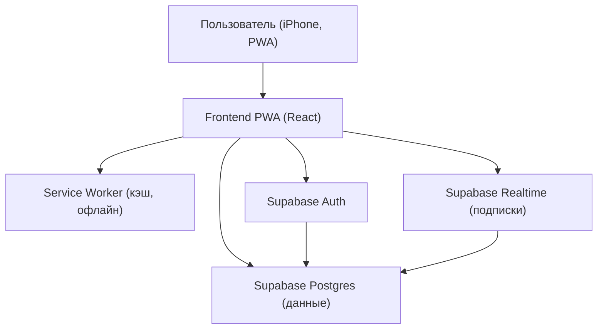
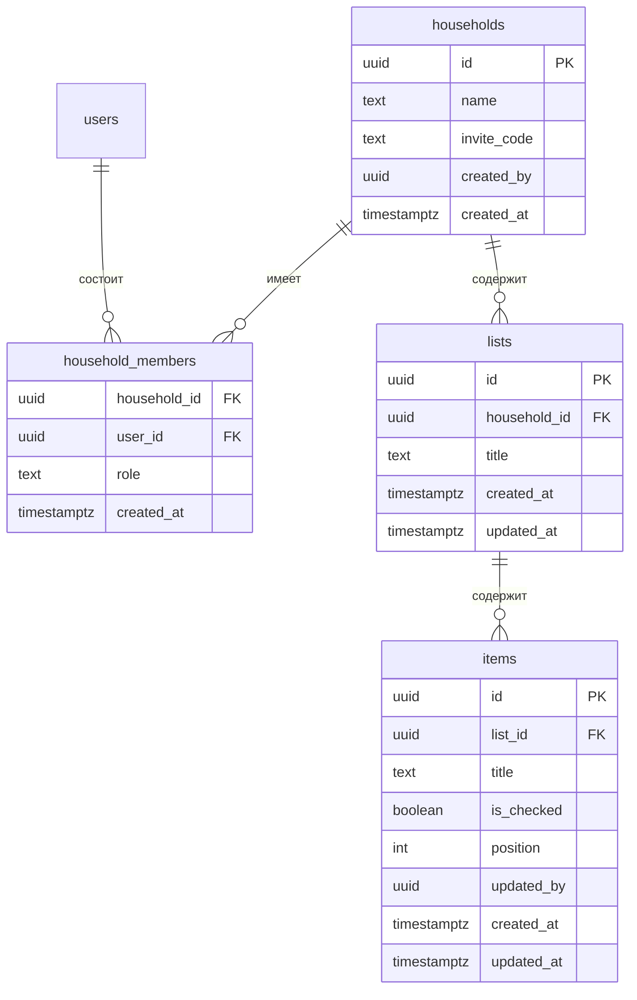

## 1. Архитектура



## 2. Технологии
- Frontend: React@18 + TypeScript + Vite
- Стили: tailwindcss@3 (дизайн-система через CSS variables + утилиты)
- Роутинг: react-router-dom
- PWA: vite-plugin-pwa (manifest, service worker, кеширование ассетов)
- Данные/синхронизация: @supabase/supabase-js (Auth + Postgres + Realtime)
- Хранение локального состояния: in-memory + локальный кэш (например localStorage/IndexedDB для офлайна, минимально в v1)

## 3. Определения маршрутов
| Маршрут | Назначение |
|--------|------------|
| /login | Вход/регистрация/восстановление |
| /onboarding | Создание семьи или ввод кода приглашения |
| /lists | Список списков покупок |
| /lists/:listId | Экран конкретного списка и товаров |

## 4. Данные и безопасность

### 4.1 Модель данных (ER)


### 4.2 Принципы доступа (Supabase RLS)
- Пользователь видит данные только тех households, где он присутствует в household_members.
- Все операции INSERT/UPDATE/DELETE по lists/items разрешены только участникам household.
- invite_code используется только для присоединения; после вступления доступ определяется членством.

## 5. Синхронизация (Realtime)
- Подписки на изменения таблиц lists/items, отфильтрованные по household_id через запросы и клиентские фильтры.
- Обновление UI по событиям INSERT/UPDATE/DELETE.
- При конфликте (одновременная правка): стратегия v1 — «последнее обновление побеждает» (updated_at), после события выполняется точечный рефетч.

## 6. Типы данных (TypeScript, ориентир)

```ts
export type Household = {
  id: string
  name: string
  invite_code: string
  created_by: string
  created_at: string
}

export type List = {
  id: string
  household_id: string
  title: string
  created_at: string
  updated_at: string
}

export type Item = {
  id: string
  list_id: string
  title: string
  is_checked: boolean
  position: number
  updated_by: string | null
  created_at: string
  updated_at: string
}
```

## 7. PWA-детали
- Manifest: имя, иконки, theme_color, display=standalone, orientation=portrait.
- Safe-area: использование CSS env(safe-area-inset-*) для нижних панелей и отступов.
- Офлайн поведение v1: приложение открывается, показывает последний закэшированный экран + баннер «Офлайн», блокирует операции, которые точно требуют сети (вступление/логин).
